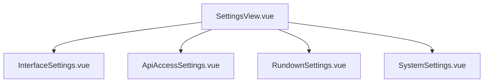

# Vue Component Map

This file provides a hierarchical map of Vue components and their relationships in the Show-Build frontend application.

*Last updated: 2025-08-11*

## Component Statistics

- **Total Components**: 38
- **Views**: 6
- **Settings Components**: 4
- **Modal Components**: 13
- **Core Components**: 15

## Component Hierarchy

### Views (Primary Routes)
```
src/views/
├── AssetsView.vue (106 lines)
│
├── DashboardView.vue (52 lines)
│
├── EpisodesView.vue (685 lines)
│
├── ProfileView.vue (230 lines)
│
├── SettingsView.vue (325 lines)
│   ├── Uses: InterfaceSettings.vue
│   ├── Uses: ApiAccessSettings.vue
│   ├── Uses: RundownSettings.vue
│   └── Uses: SystemSettings.vue
│
├── TemplatesView.vue (123 lines)
│
```

### Settings Components
```
src/components/settings/
├── ApiAccessSettings.vue (658 lines)
│   ├── Emits: update:modelValue, save
│
├── InterfaceSettings.vue (265 lines)
│   ├── Props: modelValue, type, default, theme, editorFontSize, editorFontFamily, editorLineNumbers, editorWordWrap, editorAutoSave, sidebarWidth, compactMode, showToolbarLabels, highContrast, reducedMotion, keyboardShortcuts
│   ├── Emits: update:modelValue, save
│
├── RundownSettings.vue (279 lines)
│   ├── Emits: update:modelValue, save
│
├── SystemSettings.vue (1362 lines)
│   ├── Props: modelValue, type, default
│   ├── Emits: update:modelValue, save
│
```

### Modal Components
```
src/components/modals/
├── AssetBrowserModal.vue
├── FsqModal.vue
├── GfxModal.vue
├── LiveModal.vue
├── MusModal.vue
├── NatModal.vue
├── NewItemModal.vue
├── PkgModal.vue
├── SotModal.vue
├── TemplateManagerModal.vue
├── VoModal.vue
├── VoxModal.vue
├── CueModal.vue
```

### Core Components
```
src/components/
├── ColorSelector.vue (654 lines)
├── ContentEditor.vue (1840 lines)
├── EditorPanel.vue (330 lines)
├── EpisodeListTest.vue (68 lines)
├── EpisodeSelector.vue (64 lines)
├── LoginModal.vue (223 lines)
├── OrganizationEdit.vue (561 lines)
├── StackOrganizer.vue (2994 lines)
├── RundownManagerBACKUP.vue (1 lines)
├── RundownPanel.vue (318 lines)
├── ScriptCompiler.vue (380 lines)
├── ScriptEditor.vue (545 lines)
├── ShowEdit.vue (724 lines)
├── CueToolbar.vue (151 lines)
├── ShowInfoHeader.vue (203 lines)
```

## File Size Analysis

### Large Files (>1000 lines)
- StackOrganizer.vue: 2994 lines (85.6 KB)
- ContentEditor.vue: 1840 lines (59.0 KB)
- SystemSettings.vue: 1362 lines (45.9 KB)

### Recently Extracted Components
- ✅ ApiAccessSettings.vue: 658 lines
- ✅ InterfaceSettings.vue: 265 lines
- ✅ RundownSettings.vue: 279 lines
- ✅ SystemSettings.vue: 1362 lines

## Component Dependencies

### Import Graph


## Notes

- Components marked with ✅ have been successfully refactored
- File sizes are approximate and may vary with formatting
- This map is auto-generated - run `node update-component-map.js` to update
